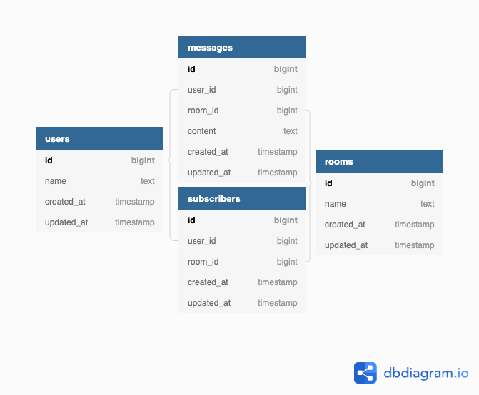

### Take-Home Code Challenge
This repository is for a challenge from a prospective employer. To prevent misuse, no specific company or individuals are named. The salient details from the [prompt](#prompt) are given at the bottom of this README.

### Setup
This challenge was completed using:
- Ruby 2.5.5
- Rails 5.2.3
- PostgreSQL 11.2

To set up for demonstration:
- clone this repository, `cd` into the project root, and run
- `bundle install`
- `rails db:{create,migrate,seed}`
- `rails s`

### Process

##### Preparation
Prior to receiving the challenge, I had spoken with the team lead at a high level about the use of AWS API Gateway and Lambda in the current tech stack at the company. After receiving the challenge, I initially looked into using a new framework "Jets" as it is designed specifically for that purpose. In the short time I allocated for this, I learned that Jets does not currently support Websockets. Given that modern applications are likely to use Websockets for continuous communication and fall back to long polling when necessary, I felt it was wiser to do this challenge as a traditional Rails application.

##### Database
At that point, I started by thinking about what I wanted to build.  
- I decided I wanted to have Users, but signup and login would be implemented elsewhere on the site. I pre-seeded a set of users and added a field to type in the username prior to joining any channels.  
- A chat application can work as a single room, however I wanted to explore using multiple rooms so I created a new table for Rooms and pre-seeded it with a set of topics.  
- I also wanted to be able to maintain a chat history for scrollback. Because of this, I created a table for Messages which references both a user and a room, and contains "content".  
- Finally, I wanted to be able to provide a list of current participants in the room. I set up a quick join table for Subscribers which references both a user and a room. Unlike Messages, Subscribers are deleted when a user leaves a room.

This leaves me with the below Schema:

##### Testing
I referenced prior projects to make sure I had the right set of gems and serve as examples for using matchers like `have_broadcasted_to().with{}`. Throughout the challenge, I followed TDD practices while building out the back end. For the front end, I have not yet learned any tools for testing UI interaction that involves Javascript, so I tested manually with 1 to 4 browser windows.

##### Interaction
Normally a user would have an account and be logged in prior to visiting the chat area. For this challenge, I made a quick and dirty workaround for this by hiding the chat area until the user types in a name and clicks the "Set" button. After clicking, the connection is readied and the UI changes to show the chatroom options.

The user can now select any existing chat room, or enter their own. The application will prefer the value of the `Create Room` field so long as it is not empty. Once the user clicks `Join`, they will be added into the room. With more time, I would validate that the entered room name adheres to guidelines defined by business needs.

When users join or leave the room, their presence change is announced in the main chat window. This message has a different CSS class from other messages so that it can be targeted for unique styling. Additionally, their names are (respectively) appended to and removed from the User List displayed to the left of the main chat window. This allows users to easily see who is participating at any time.

Included in the `user-joined` broadcast are a collection of the last 5 messages for the room and a collection of the current users in the room. I elected to include these in the Websockets interface to limit the breadth of the application, but in a real-world application it wouldn't make sense to re-broadcast this content to users who are already present in the room. I would instead take the approach to create one or two RESTful API endpoint(s) that the joining user could use to fetch those details when they first join.

##### Next Steps

As previously mentioned, I do not have an interaction pattern for users registering or logging in, so I am simply using names as an identifier for establishing a connection. I would want to instead use an encrypted cookie set elsewhere in the application with a unique identifier.

I saved Messages to the database for the purpose of allowing for scrollback, where a user can retrieve message history for the channel. In a production application, I would want to have an API endpoint to get a paginated collection of messages. I would detect users attempting to scroll up while near or at the top of the message window, and then retrieve messages prior to the earliest shown. This would use the timestamp of the earliest message for filtering.

### Prompt
Build a very simple chat/messaging app that performs a specific set of functionality in a desktop browser or mobile browser. This should allow two users to send short text messages to each other, like Facebook Messages app or Google Chat.
- It's possible to type a short message and have it sent to another user
- It's possible to see messages sent from another user appear reasonably soon after they were sent

##### Considerations
- This should be extremely basic, certainly more so than the example apps above
- Don't spend much if any time on accounts, users, or registration; it's perfectly fine to have one or two "hardcoded" accounts that simply work with each other
- Don't spend much if any time on graphics or visual appeal; we are looking at functionality, testing, coding style, and design decisions more than appearance
